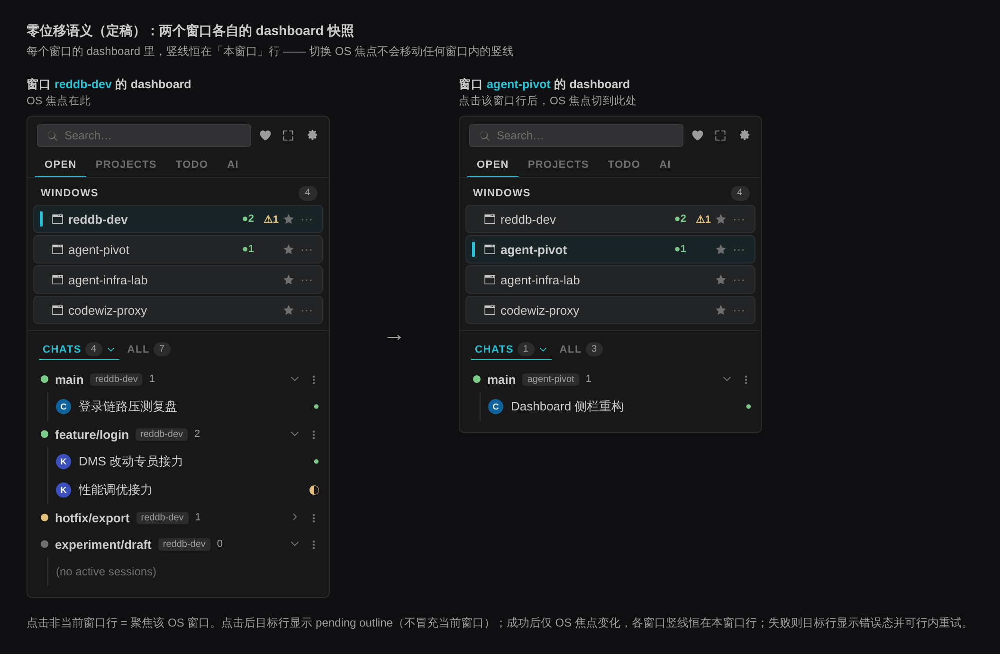
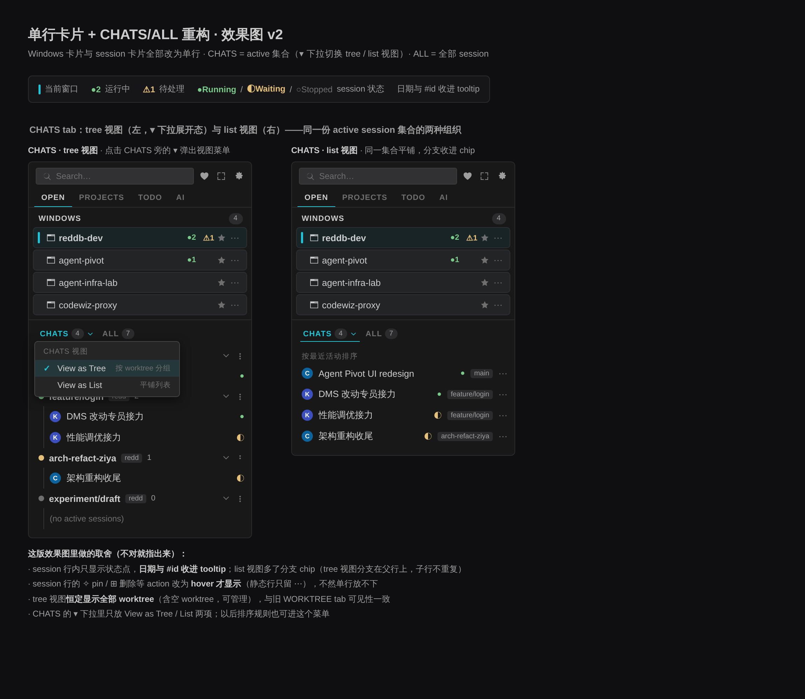
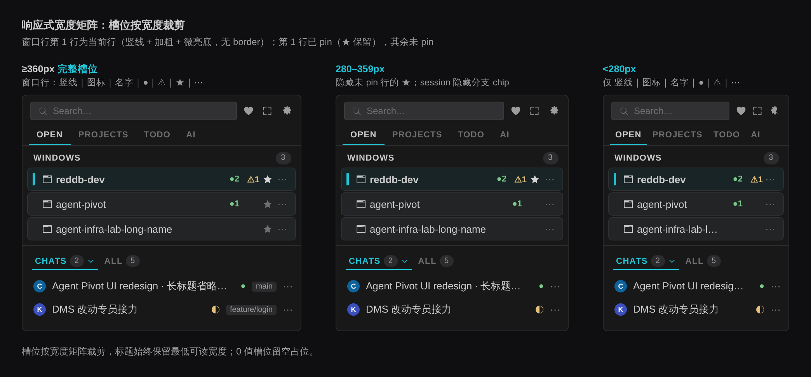

# OPEN Tab 重构 PRD：常驻 Window Switcher + 统一 Chats 面板

> v3.1 修订版。批注处理：指示槽位澄清（非数字，等宽空白槽）、删除 folder 槽位、session 行内日期移除（仅 tooltip）、ALL 明确同样单行化、tree 视图恒定显示全部 worktree（取消 Show All Worktrees 开关）。
>
> 历史版本：v1 三方评审（PM/UX/技术）→ v2 补功能处置清单/键盘章节/里程碑重排 → v3 解决核心语义冲突（三态模型/ARIA list/响应式矩阵/连接态禁用）→ v3.1 批注修订（当前）。

## 背景

当前 OPEN tab 存在三个结构性问题：

1. **双分组冗余**：`CURRENT WINDOW` 与 `OPEN WINDOWS` 是两个独立分组，当前窗口以一张重复的大卡片呈现（`getCurrentWorkspaceGroupContent` + `current-detail` 卡片），两个分组之间还有一套可拖拽分隔条（`open-tab-split-resizer` / `webviewOpenTabSplitScripts.js`）。
2. **切换窗口产生布局位移**：当前窗口用宽度可变的 `Current` 文字标签（`.current-window-indicator`）标识，切换窗口时标签出现/消失、卡片展开/收起，下方内容的 Y 坐标全部变化。
3. **session 面板层级冗余**：当前为三层结构——顶层 OPEN tab → `WORKTREE` / `CHATS` surface tab → CHATS 内 `ACTIVE` / `ALL` 两个子 tab（可见文案为 ACTIVE / ALL，类型 id 为 `'active' | 'sessions'`）。WORKTREE surface 的 session 列表部分只列 live session（"The Worktree surface lists only live sessions; history stays in Chats."），与 CHATS ▸ ACTIVE 是**同一集合的两种组织形式**。注意：WORKTREE surface 同时是 worktree 全生命周期管理 UI 的宿主（管理菜单、provisioning 行等，见「现有功能处置清单」），这是本重构必须完整迁移的资产，不是可丢弃的冗余。

设计共识（效果图评审结论）：最合适的形态不是下拉菜单，也不是把 Window 降级成筛选条件，而是**常驻、同步、零位移的全局 Window Switcher**——更像 VS Code 的 Activity Bar，而不是普通内容列表。

## 目标

- 用一个常驻 `WINDOWS N` 分组取代 `CURRENT WINDOW` / `OPEN WINDOWS` 双分组，窗口行固定顺序、固定行高，切换窗口零布局位移。
- Window 卡片与 session 卡片全部单行化。
- 用 `CHATS`（active 集合，支持 tree / list 双视图）+ `ALL`（全部 session）两个 tab 取代现有 `WORKTREE` / `CHATS` + `ACTIVE` / `ALL` 的多层 tab 结构。
- 切走再切回来时恢复窗口独立的浏览状态（tab、滚动位置、展开的 worktree、视图模式）。
- WORKTREE surface 与 history 面板的存量功能**零静默丢失**（处置清单逐项落实）。

## 非目标

- 不改变 PROJECTS / TODO / AI 三个顶层 tab。
- 不改变 session 的**底层业务语义与结果**（创建/恢复/删除的对象与行为不变）；入口位置变化本身属于有意为之的流程调整，由「迁移与沟通」覆盖。
- Focus 聚合功能页保留为独立功能，不被本功能替代，也不在本期改动范围内。
- 不做窗口拖拽排序（顺序稳定由系统侧维护，见「状态模型」）。
- 不改 UI Bridge 的进程/协议结构，仅消费其广播数据。
- **不提供新旧布局并存的设置开关**：维护两套 IA 成本远高于收益，迁移通过 CHANGELOG + 一次性提示平滑（见「迁移与沟通」）。

## 用户场景与证据

目标用户画像：**多 worktree + 多窗口的 AI 重度用户**（本仓库自身工作流即如此——AGENTS.md 强制每任务一个 worktree）。**代表性局限**：证据主要来自本仓库自身工作流，代表性有限——规格冻结前必须完成「成功指标与观测」中的 ≥5 名真实多窗口用户走查。定性场景：

- 在 4–6 个窗口间频繁切换查看 session 状态，旧 UI 每次切换布局跳动、当前窗口卡片重复占屏。
- 按 worktree 维度管理十几个 session（tree 视图），或快速找到最近活跃的那个（list 视图）。
- 需要复制 session id 到终端 resume，或在对话中引用。

（本期无量化埋点基线；成功指标一节定义了发布后的最低观测手段。）

## 信息架构

```
OPEN tab
├── WINDOWS N            ← 常驻窗口切换器（含当前窗口，固定顺序）
│   └── window row × N   ← 单行：指示槽位(竖线)｜图标｜窗口名｜运行数｜待处理数｜pin｜更多
├── CHATS n ▾   ALL m    ← 当前窗口的 session 面板（原卡片内 surface 提升为平铺区域）
│   ├── CHATS            ← active session 集合，▾ 下拉：View as Tree（默认）/ View as List
│   └── ALL              ← 全部 session（含 stopped / 历史），现有 SESSIONS 面板平移，同样单行化
└── 工具行               ← provider 过滤（仅 ALL）、Manage（仅 ALL）、新建 session 入口（右侧）
```

- `WINDOWS` 包含当前窗口在内的全部本机 VS Code 窗口；点击哪一行，系统焦点切到哪个窗口。
- **当前窗口语义**：每个窗口的 dashboard 恒把"本窗口"标记为当前（`kind === 'current'`），竖线恒位于本窗口对应行；bridge 不广播他窗口的 session 列表，CHATS/ALL 面板内容恒为本窗口数据。概念图中的"切换前/后"应理解为两个窗口各自的 dashboard 快照。
- bridge 未就绪时当前行固定置顶，就绪后按稳定顺序归位（避免就绪瞬间的非交互重排误读）。

### 命名决策记录

定稿 `CHATS`（active 集合）/ `ALL`（全部）。理由：ALL 与现网子 tab 可见文案一致，是零摩擦迁移桥；CHATS 与产品内已有词汇（Rename Chat / Archive Chat）及 Copilot Chat 生态一致。已知取舍：旧版 CHATS surface 指"全部会话"，新 CHATS 收窄为"active 集合"，存在同名异义——通过「迁移与沟通」中的映射表与一次性提示消歧。反方意见（评审提出，记录备查）：`CHATS = active` 相对旧版 CHATS（=全部）是语义收窄，一次性提示无法完全消除长期理解成本；建议优先验证 `ACTIVE / ALL`，或折中 `ACTIVE CHATS / ALL`。**当前仍定稿 CHATS / ALL**（所有者决策），但把"命名理解成本"列入可用性走查的验证项——若走查中多数用户对 CHATS=active 产生误解，发布前切换到 ACTIVE / ALL（改动仅限文案层）。

效果图（`zero-shift` 与 `concept` 为过程稿，tab 命名以定稿 CHATS/ALL 为准；zero-shift 的 WINDOWS 区零位移语义仍然有效）：







（`open-tab-window-switcher-concept.png` 为最早的过程稿，仅留档，tab 命名与细节以定稿为准。）

## 数据来源

| 数据 | 来源 | 说明 |
|---|---|---|
| 窗口列表、稳定顺序、各窗口运行数/待处理数 | UI Bridge 广播（`src/openWorkspaces/bridgeClient.ts`、`shared/attention-bridge`） | 全局同步状态，所有窗口一致 |
| 当前窗口 | 本窗口自身（`kind === 'current'`），bridge 未就绪时置顶兜底 | 竖线恒在本窗口行 |
| active session 集合 | `activeAiSessions`（现有 view model） | CHATS 唯一数据源 |
| 全部 session | `historyProjection`（codex / kimi / claude 三 provider 合并） | ALL 数据源，pinned-first 排序沿用 |
| worktree 分组 | session 的 `worktreeKey` + `src/worktrees` 健康状态 | tree 视图分组键 |

## 现有功能处置清单

实现前必须全部落实为代码映射，不允许实现期临时决策。每项标注 keep / move / drop + 归宿。

### WORKTREE surface（现状：完整 worktree 清单 + 管理面）

| 功能 | 处置 | 归宿 |
|---|---|---|
| 有 active session 的 worktree 分组列表 | keep | CHATS tree 视图 |
| 无 active session 的 ready worktree（含 "(no active sessions)" 占位） | keep | CHATS tree 视图原样显示——tree 恒定显示全部 ready worktree，可见性与旧 WORKTREE surface 一致，可管理 |
| 组行 ⋯ 菜单（New worktree… / Remove worktree / branch create / group rename / derive / add repo / delete group） | keep | tree 视图组行 ⋯ 原样保留 |
| provisioning / failed 行（queued/creating/setting-up/failed + retry/cancel/dismiss） | keep | CHATS tree 视图顶部原样渲染 |
| "Current" anchor 行（主 checkout session，特殊语义） | keep | tree 视图固定首组 |
| adopt 建议 / deletion journal / collapse-all / 截断提示 / health、detached 标识 | keep | tree 视图原样保留 |
| 创建表单槽位（`data-worktree-group-form-slot`） | keep | tree 视图原位 |
| WORKTREE surface tab 本身 | drop | 由 CHATS tree 视图替代（迁移映射见「迁移与沟通」） |

### CHATS ▸ ALL（history 面板）

| 功能 | 处置 | 归宿 |
|---|---|---|
| provider 多选过滤菜单（含 unavailable 态与计数） | keep | ALL 工具行左侧 |
| Manage Sessions 按钮 | keep | ALL 工具行；点击进入选择态后才渲染行内 checkbox（与单行静态布局解耦） |
| 批量选择 + All/Clear/Archive 批操作条 | keep | 同上，仅选择态出现 |
| PINNED 置顶分组 | keep | ALL 列表 pinned-first，再按最近活动（与 `historyProjection` 现有行为一致） |
| availability 降级提示 | keep | ALL 顶部状态条 |
| 新建 session 入口（quick create + 下拉） | keep | CHATS/ALL 工具行右侧，与现状一致 |
| ACTIVE 子 tab | drop | 由 CHATS 替代（语义等价） |

### current-detail 卡片独有资产

| 功能 | 处置 | 归宿 |
|---|---|---|
| Save Workspace 入口 | move | 当前窗口行 ⋯ 菜单 |
| AI 汇总 badge（AI n / ●n / attention） | move | 由窗口行 `●n` / `⚠n` 槽位承载 |
| 空态"本窗口未开文件夹"（`getOpenCurrentWorkspaceEmptyState`） | move | 见「错误和空状态」空窗口行 |

## UI 行为

### Window 行（单行，槽位定宽）

槽位顺序：`指示槽位｜图标｜窗口名(+环境 chip/消歧后缀)｜运行数｜待处理数｜pin｜更多`

- **指示槽位**：不是数字，而是每行左侧预留的一条等宽空白槽——当前窗口行在这里显示青色细竖线，其余行留空。意义在于零位移：所有行都为竖线预留了位置，当前态出现/消失时行内容完全不移动（这正是废除旧版宽度可变 `Current` 文字标签的原因）。
- folders 数量不在行内显示（槽位精简），仅在 tooltip 中提供 folder 列表。
- **运行数**：绿色 `●n`；**待处理数（needs attention）**：黄色 `⚠n`（形状 + 颜色双编码，色弱可分辨）。术语统一为「待处理 / needs attention」，全文不再混用"异常数"。两计数语义独立：一个 session 是否计入其一或两者由运行状态与 `needsAttention` 标记各自决定，不互斥；session 行的 Waiting 状态点（◐）与窗口行 ⚠ 计数同源。为 0 时留空但保留槽位宽度；空槽位也给 tooltip（"No running sessions" / "Nothing needs attention"）。
- **pin**：沿用现有 `toggle-open-workspace-pin`，pin 影响稳定顺序（置顶规则与现有一致）。**已 pin 行的 ★ 永久显示；未 pin 行的 ★ 仅 :hover / :focus-within 显示**（减少噪声并释放宽度）。pin 导致行跳动时保证该行仍在可视区，并给一次 ≤150ms 底色闪烁确认。
- **更多 `⋯`**：收进现有窗口级 action + 当前行的 Save Workspace。
- 窗口名超长只省略，不换行。**tooltip 只做补充**：核心信息（当前态、跳转目标、错误）必须在界面与 accessible name 中成立；tooltip 首行恒为动词开头的 `Focus window: <完整名>`（非当前行），次行为环境标签与 folder 列表。
- **远程 / 同名窗口消歧**：带 `environmentLabel`（SSH/WSL/Dev Container…）的窗口在名字后追加环境 chip；同名窗口按**最短唯一后缀**算法消歧（逐段追加路径分量直至唯一；后缀算法确定性，不随刷新变化）。
- **点击非当前行 = 聚焦该 OS 窗口**（复用 `navigationController` 导航链路）；**点击当前行 = 空操作**，且当前行不显示 ↗ 暗示图标、cursor 为 default、accessible name 为 `Current window: <名>`（区别于其他行的跳转语义）；双击/中键 = 无行为。
- **误触防护**：`★` / `⋯` 命中区 ≥24×28px、`stopPropagation`、与行主体点击区之间留 ≥4px 死区；非当前行 hover 时行尾显示 ↗ 跳转暗示图标。

### 窗口行的三种状态（当前窗口语义）

竖线**恒在"本窗口"行，永不移动**——它标记的是 dashboard 宿主窗口自己，不随 OS 焦点预测性跳动：

| 状态 | 表现 |
|---|---|
| 本窗口 | 青色竖线 + 名字加粗 + 行底微亮；主按钮禁用（或 `aria-current="true"`），pin/⋯ 仍可操作 |
| 正在切换到（pending） | 点击非当前行后，**目标行**显示 spinner 或 pending outline——不冒充当前窗口，本窗口竖线原位不动 |
| 切换失败 | 清除 pending，目标行显示短暂错误态 + 行内重试入口（不只是瞬时 toast；用户必须能看出是哪一行失败、如何重试） |

焦点请求经 bridge 是异步的。目标窗口在另一 Space/显示器或被最小化时，以 OS 切换动画为准，面板内不额外补偿。**bridge connecting 期间：禁用其他窗口行（置灰 + 不可点）并显示 "Connecting…" 状态，恢复后由用户重新点击——不做点击排队**（排队可能在用户改变意图后突然切换窗口，且超时/覆盖/取消语义复杂）。

### 切换窗口（零位移）

- 窗口行顺序不变，禁止按最近使用自动重排；所有行等高，当前行不放大、不展开。
- 焦点切换时各窗口 dashboard **没有任何"竖线移动"**——每个窗口的竖线恒在本窗口行（见「窗口行的三种状态」）；各窗口的 CHATS/ALL 面板内容恒为本窗口 session，不发生替换。概念图中的"切换前/后"是两个窗口各自的 dashboard 快照，不是同一面板的动画。
- 零位移承诺仅覆盖焦点切换；窗口增删导致行数变化时的位移是预期行为。
- header、tab 条、`WINDOWS N` 标题、各行 Y 坐标、CHATS/ALL tab 行 Y 坐标逐像素不变。
- 渲染约束：窗口行禁用 fitty 字体重算（替换后瞬态宽度抖动）；内部滚动区 `scrollbar-gutter: stable`（滚动条出现不改变行宽）；bridge 状态条占用固定槽位（出现/消失不推挤布局）。

### 窗口数超阈值时内部滚动

- 阈值确定规则：可见行数上限 = `min(6 行, 面板可用高度的 40%)`（向下取整），超过则 WINDOWS 区固定高度 + 内部滚动，不得把 CHATS/ALL 区向下挤。
- `overscroll-behavior: contain`，不 `preventDefault` 截断滚轮链；常驻细滚动条 + 底部渐隐两种 affordance（不再叠加"还有 N 行"文字提示，减少视觉噪声）；该区域键盘可滚（见「键盘与焦点」）。
- 切换后当前行不在可视区时滚动至可见（仅该区域内部滚动，面板其余部分不动）。

### CHATS：active 集合，▾ 下拉切换双视图

- tab 文案 `CHATS n`（n = active session 数），右侧 `▾` 为**分体按钮**（与 tab 文字点击区分离，命中区 ≥24×24px，区间留 ≥4px 死区）。**DOM 结构约束：`role="tab"` 的 CHATS tab 与 ▾ 菜单触发按钮是两个相邻的独立控件，菜单按钮不得嵌在 tab 内。** 非活动 tab 上的 ▾：点击 = 激活 CHATS 并开菜单。
- ▾ 弹出 VS Code 风格浮层菜单（`role="menu"`，选项 `menuitemradio` + `✓`）：
  - `View as Tree`（默认）：按 worktree 分组。
  - `View as List`：平铺列表，按最近活动排序。
- 视图模式按窗口持久化（见「状态模型」）。后续排序规则也可进此菜单。
- CHATS tab 沿用现有 attention dot（有 needsAttention session 时 tab 上显示）。
- **tree 视图**：恒定显示全部 ready worktree（含无 active session 的空 worktree，保留占位与管理能力），与旧 WORKTREE surface 可见性一致。组行 = 状态点｜worktree 名｜repo chip｜计数｜展开箭头｜⋯（管理菜单全量保留）；组行整行点击 = 展开/收起（VS Code tree 惯例），展开状态按窗口记忆；provisioning 行渲染在顶部；"Current" anchor 固定首组。
- **list 视图**：平铺 session 行，每行带分支 chip（tree 视图中分支信息在父组行上，子行不重复展示）。

### Session 行（单行）

槽位：`provider 头像｜标题｜状态点｜分支 chip（仅 list 视图）｜hover actions｜⋯`

- **状态映射**：`●` 绿 = Running（`starting` 归入 Running，显示 `● Starting`）；`◐` 黄 = Waiting（≜ `needsAttention` 标记，不是独立执行态）；`○` 灰 = Stopped（仅 ALL）。状态词与日期进 tooltip 与 `aria-label`。
- **行内不显示日期**（槽位精简），日期仅在 tooltip 中提供：今天 `HH:mm`（区分同一天多个 session 的新旧）；今年其他日期 `MM-DD`；跨年 `YYYY-MM-DD`。
- 完整日期、session `#id`、完整标题进 tooltip；`⋯` 菜单含 **Copy Session ID**（tooltip 有延迟、不可选中、键盘不可达，不能作为 #id 的唯一出口）。
- **action reveal**：`:hover, :focus-within` 均触发（触控/键盘可达）；覆盖式呈现（带不透明行底色，行内任何元素不位移）；hover action 同时存在于 `⋯` 菜单。
- **破坏性 action（删除/归档）只进 `⋯` 菜单**，不进 hover 区（hover 区只放安全 action）。
- 点击行 = 打开/聚焦该 session（行为与现有一致）。

### ALL：全部 session

- = 现有 ALL（sessions）面板平移 + 单行化：工具行左侧 provider 过滤与 Manage、右侧新建入口；pinned-first + 最近活动排序；选择态才渲染 checkbox 与批操作条；顶部保留 availability 降级提示。
- `ALL m` 计数含 active 子集（ALL ⊇ CHATS），tab tooltip 说明 "All sessions, including active ones"。

### 单击语义一览（可预测性约束）

| 行类型 | 单击 | 双击/中键 |
|---|---|---|
| 窗口行（非当前） | 聚焦该 OS 窗口 | 无行为 |
| 窗口行（当前） | 空操作 | 无行为 |
| worktree 组行 | 展开/收起 | 无行为 |
| session 行 | 打开/聚焦该 session | 无行为 |

## 视觉规范

- 行高：window 行 30px；session 行 30px；worktree 组行 28px；同区域行高一致。
- 颜色 token：运行数与 Running 点用现有成功色；待处理数与 Waiting 用 `--vscode-editorWarning-foreground`（**禁止裸黄色**，浅色主题下需达标）；弱化文字需满足 4.5:1 对比度，不达标时换 token 而非降对比。
- 当前行三重编码：竖线 + 名字加粗 + 行底微亮，**实现不得砍为只剩竖线**；**不使用整行边框作为当前态**（边框会被误读为选中态且造成 1px 位移）；当前行底色与 hover 底色需可区分。
- focus 有可见 outline，不得仅用底色变化表达。
- 动画预算：仅 ~100ms 颜色渐变（竖线、行底色）；`prefers-reduced-motion` 时即时切换，无动画。
- 所有数字槽位为 0 时留空但保留槽位宽度，布局不收缩。

### 视觉状态矩阵（window 行必须全覆盖）

| 状态 | 竖线 | 行底 | 名字 | 其他 |
|---|---|---|---|---|
| 默认 | 空槽 | 透明 | 常规 | 未 pin 的 ★ 隐藏 |
| 当前（本窗口） | 青色竖线 | 微亮 | 加粗 | 无 ↗；cursor default；主按钮禁用 |
| hover（非当前行） | 空槽 | hover 底色 | 常规 | ★/⋯/↗ 显示 |
| 键盘 focus | 空槽/竖线不变 | 不变 | 不变 | 可见 outline |
| pending（切换中） | 不变（仍在本窗口行） | 目标行 pending outline 或 spinner | 常规 | 目标行不冒充当前 |
| error（切换失败） | 不变 | 短暂错误态 | 常规 | 行内重试入口 |

### 响应式宽度矩阵（侧栏实际宽度经常只有 220–300px）

| 宽度 | window 行 | session 行 |
|---|---|---|
| ≥360px | 完整槽位 | 完整槽位（含分支 chip） |
| 280–359px | 隐藏未 pin 的 ★（已 pin 保留） | 隐藏分支 chip |
| <280px | 只保留：竖线｜图标｜名字｜●运行数｜⚠待处理｜⋯ | 只保留：头像｜标题｜状态点｜⋯ |

- 标题/名字槽位保留最低可读宽度（≈96px），其余槽位按矩阵裁剪；裁剪规则用容器宽度驱动（container query 或面板宽度 class）。
- 验收覆盖 200% zoom、浅色 / 深色 / High Contrast 主题与 `forced-colors` 模式。

## 键盘与焦点（含 aria）

- **WINDOWS 列表**：`role="list"`，行 `role="listitem"`——行内是三个独立控件：「聚焦窗口」主按钮、Pin 按钮、More 按钮（`option` 内嵌交互按钮不是稳健模式，弃用 listbox 模型）。↑/↓ 键作为增强导航在行间移动；所有按钮有可预测 Tab 顺序（主按钮 → ★ → ⋯）且均可 Tab 到达。当前行的主按钮禁用（`aria-current="true"`，accessible name `Current window: <名>`），Pin/More 仍可操作。
- **CHATS/ALL tab**：`role="tablist/tab"`，←/→ 切换，沿用现有 tab 的 `aria-selected` 管理模式；`▾` 是与 tab 相邻的独立按钮控件（不嵌进 `role="tab"`），`aria-haspopup="menu"` + `aria-expanded`；菜单内 ↑/↓ 导航，Esc 关闭并焦点回触发按钮。
- **tree 视图**：`role="tree/treeitem"`，`aria-expanded` / `aria-level`；←/→ 折叠/展开。
- 计数槽位带 `aria-label`（"2 running sessions"）；tooltip 内容与 `aria-label` 同步，禁止 `title`-only 信息。
- 激活窗口行后焦点回到触发元素（面板不抢 OS 焦点之外的焦点）。
- **live region**（`aria-live="polite"`）播报：窗口切换（"Now in window agent-pivot"）、session 需要处理（"Session X needs attention"）——后者是黄点语义对屏幕阅读器用户的唯一出口。

## 状态模型与持久化

两类状态分离：

- **全局同步状态**：窗口列表、稳定顺序、各窗口运行数/待处理数。由 bridge 广播维护，所有窗口一致；单一窗口离线时其余窗口降级展示（见「错误和空状态」）。
- **窗口独立状态**（按窗口 `scopeIdentity` key 隔离持久化，切走再切回恢复）：

| 状态 | 载体 | reload 后 |
|---|---|---|
| 当前 tab（CHATS / ALL） | 宿主侧 globalState | 恢复 |
| CHATS 视图模式（tree/list） | 宿主侧 globalState | 恢复 |
| 展开的 worktree 组集合 | 宿主侧 globalState | 恢复 |
| 面板滚动位置 | webview state | 重置（可接受） |

依据：dashboard webview `retainContextWhenHidden: true`，OS 级切走切回 webview 不销毁，DOM 原样保留；innerHTML 权威替换时走现有 capture→replace→restore 范式（`media/webviewAiSessionViewStateScripts.js` 为改造主场）。

**存量迁移**：已持久化 `surface: 'worktree'` 的用户 → 迁移为 CHATS + tree 视图（tree 恒定显示全部 worktree，可见性与旧版一致，无需迁移开关）；`surface: 'chats'` + tab `'active'` → CHATS + tree（默认视图）；tab `'sessions'` → ALL。

## 迁移与沟通

- CHANGELOG 条目 + 新旧映射表：WORKTREE tab → CHATS ▾ tree（完整清单可见性一致）；ACTIVE 子 tab → CHATS；ALL 子 tab → ALL；Current 文字标签 → 左侧青色竖线。
- 首次打开一次性 in-product 轻量 notice（指向映射说明）；从 WORKTREE surface 迁移的用户在 CHATS tree 看到与旧版一致的完整 worktree 清单。
- 明确决策：**不提供新旧布局并存的设置开关**（维护两套 IA 成本远高于收益，迁移提示已覆盖平滑过渡）。

## 错误和空状态

- 只有 1 个窗口：仍显示 `WINDOWS 1`（结构不特殊化），点击行为空操作。已知取舍：单窗口用户永久多付一个分组 header 的空间。**发布前必须确认单窗口用户占比**；若占比显著，考虑单窗口紧凑态（隐藏分组 header，仅保留行）——该决策不阻塞 M1，但阻塞正式发布。
- bridge `connecting`：WINDOWS 区显示 "Looking for your other open windows…"（沿用现有文案）；**其他窗口行禁用（置灰不可点），由用户恢复后重新点击，不做点击排队**。
- bridge `unavailable` / `update-required`：WINDOWS 区显示对应状态条（沿用现有两条文案与 "Show UI Bridge Extension" action），状态条占固定槽位，当前窗口行仍可用。
- **切换失败**：目标行显示短暂错误态 + 行内重试入口（不只有 toast）。
- 空窗口（无 folder）：窗口行正常显示（数字槽位为空），其 CHATS/ALL 面板显示"未打开文件夹"空态（沿用 `getOpenCurrentWorkspaceEmptyState` 语义）。
- CHATS 无 active session：显示空态（"No active sessions" + 新建入口）。
- ALL 无 session：显示空态文案。
- 窗口名、session 标题过长：省略号，tooltip 看全量。

## 性能要求

- 切换窗口以「整体替换 + 几何恒等」达成零位移，**不要求行级 DOM 复用**；无变化的全量替换不得产生可见闪烁。
- 切换渲染时延预算：bridge 广播到达后首帧 ≤100ms。
- 滚动区域限定在 WINDOWS 区内，不使用整面板滚动代偿。

## 成功指标与观测

**发布前（手测 + 走查）**：

- **可用性走查**：≥5 名真实多窗口用户，完成三个任务——找到指定窗口、找到最近 active session、管理空 worktree；同时验证命名理解（CHATS=active 是否被误解）。走查通过是规格冻结的前置条件。
- 切换窗口任务完成时间基线对比（不劣化于现状）。

**发布后（轻量埋点，走现有 telemetry 通道，无新增设施）**：

- 窗口切换成功率 / 失败率 / P50/P95 完成时延。
- 任务时间：找到指定窗口、找到最近 active session。
- 错选窗口率（聚焦请求后 3 秒内再次发起切换计为疑似错选）。
- 空 worktree 管理任务完成率（tree 视图直接可见可管理，无开关前置）。
- ▾ 菜单打开率（双视图发现性）。
- 以上按单窗口 / 多窗口用户分段观察。
- **隐私约束**：telemetry 只记录动作与耗时，不记录窗口名、路径、session id。
- 反馈渠道：CHANGELOG + 仓库 Discussions 置顶帖。

## 隐私和同步

- 窗口列表与计数仅在本机窗口间通过 bridge 同步，不外发。
- 窗口独立状态按窗口 key 存于宿主侧 globalState / 各窗口 webview state，不跨窗口共享。

## 实现要点（代码映射）

**删除**：

- `OPEN_CURRENT_WORKSPACE_GROUP_NAME` / `OPEN_WINDOWS_GROUP_NAME` 双分组及 `getCurrentWorkspaceGroupContent`；`current-detail` 卡片呈现（`getWorkspaceCardDiv` 的 current 分支）。
- `.current-window-indicator` 及相关样式。
- `open-tab-split-resizer` 与 `media/webviewOpenTabSplitScripts.js`、`src/webview/webviewOpenTabSplitScripts.js`（固定高度 + 内部滚动取代分隔条）。
- AI session surface 的 `WORKTREE` / `CHATS` surface tab（`ai-session-surface-tabs`、`selectedSurface`）与 CHATS 内 ACTIVE 子 tab（`AiSessionTabId = 'active' | 'sessions'` 收敛为 CHATS/ALL）。

**修改**：

- `src/webview/webviewContent.ts`：新增 `WINDOWS N` 分组渲染（单行 window 行，槽位化）。
- `src/webview/webviewAiSessionContent.ts`：surface 重构为 CHATS（▾ 视图菜单 + tree/list 双面板）/ ALL；session 行单行化（`getActiveAiSessionRow` 槽位重排）。
- **更新协议层**：`src/dashboard/webviewUpdateMessages.ts`（`open-workspaces-updated` 升 v4：`currentWorkspaceCount` / `navigationWorkspaceCount` 等一致性字段重设计）；`media/webviewWorkspaceUpdateScripts.js`（`applyWorkspaceUpdate` / `applyOpenWorkspacesUpdate` 锚点、`isOpenWorkspacesUpdateDomConsistent`、滚动捕获选择器、pin pending 作用域）。
- **reveal 链路**：`media/webviewProjectAiUpdateScripts.js`（`reveal-workspace-session` / `reveal-workspace-worktree` 重映射到 CHATS/ALL + tree）；`media/webviewProjectScripts.js`（`onInsideProjectClick` 三分支点击契约 → 新行契约；移除 `initOpenTabSplit` / `syncResizer`）；`media/webviewProjectAiSessionControlsScripts.js`（session action 派发的容器选择器）。
- **宿主持久化与类型**：`src/aiSessions/types.ts`（`AiSessionTabId` / `selectedSurface` 收敛）；`src/aiSessions/commandController.ts`、`src/dashboard/messageHandlers.ts`（`select-ai-session-surface` 等路由替换 + 存量值迁移）；`src/openWorkspaces/dashboardController.ts`（current + navigation 统一行模型：`getCards` / `getViewSemanticRevision`）；`src/dashboard/groupCollapseController.ts`（collapse-all 对新分组的语义决策）；`package.json` 中引用 CURRENT WINDOW 卡片旧行为的失效 `deprecationMessage` 文案。
- `media/styles.scss`：新行组件样式、槽位定宽、hover/focus-within reveal、覆盖式 action、滚动区。
- 新窗口行**必须保留 `data-workspace-navigation-identity`** 等既有 data 键（reveal、pin、一致性校验、presentation 定位全部以它为键）。

**新增**：

- CHATS ▾ 视图菜单 webview 脚本；窗口独立状态持久化（`commandController` 扩展）。
- 行为契约改写/退役（按 ID）：退役 `WEBVIEW-OPEN-TAB-SPLIT-001`、`WEBVIEW-CURRENT-WINDOW-SESSION-FIT-001`、`OPEN-ALL-WINDOWS-LIST-001`；改写 `WORKTREE-GROUPING-UI-001`、`OPEN-OTHER-WINDOWS-PRIVACY-001` / `-SUMMARY-001`、`OPEN-WORKSPACE-PIN-WEBVIEW-001`、`ACTIVE-SESSION-FOCUS-REVEAL-001`、`ACTIVE-SESSION-FULL-RENDER-TRANSACTION-001`、`ACTIVE-SESSION-INCREMENTAL-PRESENTATION-ENVELOPE-001`。（实施注记：`WEBVIEW-CURRENT-WINDOW-SESSION-FIT-001` 实际为改写保留——过渡形态的 current-detail 卡片仍需 fit 约束，未退役。）
- 构建/CI 同步：`scripts/build-dashboard-webview-bundle.js` inputPaths、`run-release-packaging-checks.js`、`run-performance-architecture-baseline-checks.js`、`run-dashboard-webview-checks.js`、`run-ai-session-safety-checks.js`、`.vscodeignore`；测试面 `dashboardOpenTabSplit.test.js`（删除）、`activeSessionCardInteraction.test.js`、`worktreeGrouping.test.js`、`webviewState.test.js`、`contract/dashboardController.test.js`（随对应里程碑更新）。

## 验收标准

1. OPEN tab 只有 `WINDOWS N` 一个窗口分组；焦点切换时 header、tab 条、窗口行、CHATS/ALL tab 行 Y 坐标不变（像素级断言）；窗口增删允许位移（预期行为）。
2. 每个窗口的当前态竖线恒在本窗口行（永不移动）；点击非当前行后目标行进 pending 态（spinner/outline，不冒充当前）；失败时目标行错误态 + 行内重试；bridge 未就绪时当前行置顶。
3. Window 行与 session 行均为单行；名称超长省略不换行；0 值槽位留空占位；待处理数为 `⚠n`。
4. CHATS = active 集合，▾ 下拉可切 tree / list 视图，两种视图渲染同一集合；无 ACTIVE 子 tab；tree 视图恒定显示全部 ready worktree（含空 worktree 占位与管理入口）。
5. tree 视图组行 ⋯ 管理菜单、provisioning 行、Current anchor、adopt/deletion/collapse-all 等处置清单逐项可用；list 视图按最近活动排序且带分支 chip。
6. ALL = 现有 SESSIONS 面板平移：provider 过滤、Manage、选择态 checkbox 与批操作、PINNED 分组、降级提示完整。
7. 窗口数超阈值公式（`min(6, 40% 面板高度)`）时 WINDOWS 区固定高度内部滚动，`overscroll-behavior: contain`，CHATS/ALL 不被下挤。
8. 切走再切回：tab、视图模式、滚动位置、展开的 worktree 组恢复；reload 后 tab/视图模式/展开组恢复（滚动位置重置可接受）；存量 `surface:'worktree'` 迁移为 CHATS tree。
9. bridge connecting / unavailable / update-required 三态展示正确；connecting 期间其他窗口行禁用不可点；当前窗口行始终可用。
10. 键盘全链路可操作（WINDOWS 各行按钮可 Tab 到达、↑/↓ 增强导航；tab ←/→；▾ 菜单 ↑/↓ + Esc；tree ←/→ 折叠展开）+ aria 角色断言（list/listitem/tablist/menu/menuitemradio/tree，菜单按钮不嵌进 tab）+ live region 播报 + 可见 focus outline。
11. 误触防护断言：★/⋯ 命中区 ≥24×28px 且与行主体死区 ≥4px；未 pin 的 ★ 仅 hover/focus 显示；破坏性 action 不在 hover 区；⋯ 菜单含 Copy Session ID；非当前行 tooltip 首行为 `Focus window: <名>`；当前行无 ↗ 图标、cursor default、accessible name 为 `Current window: <名>`。
12. 同名窗口按最短唯一后缀消歧；远程窗口显示环境 chip；tooltip/aria-label 内容断言（完整名、环境、#id、完整日期）；核心信息不依赖 tooltip 独有承载。
13. 现有功能处置清单逐项有对应测试或手工验证步骤。
14. 动画 ≤100ms 且尊重 `prefers-reduced-motion`；对比度（editorWarning token、弱化文字 4.5:1）达标。
15. 响应式：≥360 / 280–359 / <280 三档槽位裁剪符合宽度矩阵，标题保留最低可读宽度；200% zoom、浅色/深色/High Contrast 主题与 forced-colors 模式下无不达标。
16. session 行内不显示日期；tooltip 日期格式：今天 `HH:mm`、今年 `MM-DD`、跨年 `YYYY-MM-DD`。

## 里程碑

- **M1：WINDOWS N 常驻切换器**。第一项工作 = 更新协议 v4 + DOM 一致性校验重设计；含单行 window 行（三态模型）、删除双分组与分隔条（同期删 split 契约/测试/构建引用）、零位移、内部滚动、bridge 三态、响应式宽度矩阵。**过渡形态声明**：M1 保留未改造的当前卡片（session surface 唯一宿主）于 WINDOWS 列表下方，M2 再将 surface 提升平铺。**M1 有独立验收子集**（窗口行/零位移/滚动/bridge 三态/响应式），涉及 session 面板的总体验收标准不套在 M1 上。
- **M2：CHATS/ALL 结构 + tree 视图 + 状态持久化**。废除 ACTIVE 子 tab 与 surface tab、session 单行化、tree 视图作为 CHATS 默认视图（管理功能全量迁移，恒定显示全部 worktree）、ALL 面板平移、窗口独立状态持久化与存量值迁移；surface/tab 契约改写同期。**M2 发布红线：必须能管理无 active session 的 worktree**。
- **M3：list 视图 + ▾ 菜单增强 + 观测**。list 视图、新增能力契约与测试补齐、成功指标埋点。

**规格冻结条件**：本版（v3）五项核心修订 + 窄宽度 wireframe 验证（见响应式宽度矩阵效果图）已完成；冻结前还须完成「成功指标与观测」中的 ≥5 名真实多窗口用户可用性走查（含命名理解验证）。
