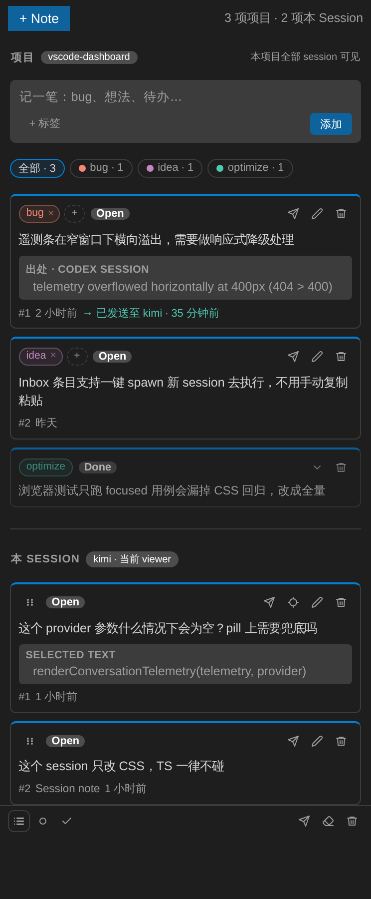

# 项目级批注（Project-Scoped Comments）PRD

日期：2026-08-07

状态：草案，待确认

## 1. 背景

Agent Pivot 的 AI Conversation viewer 已提供批注（comment）能力：选中对话原文添加**引用批注**，或添加不带引用的 **Session note**。两者都按 `(projectId, provider, sessionId)` 存储，严格属于单个 session，主流程是「起草 → 发送 → 注入该 session 的 terminal 输入框」。

实际使用中，用户对一个产品通常并行开着多个 session（codex / kimi / claude）。读某个 session 的输出时，经常会冒出**与这个 session 无关、而与整个项目相关**的内容：

- 发现一个 bug（可能在 codex 的输出里看到，但想让 kimi 去修）；
- 一个奇思妙想、一个优化点、一条待办；
- 需要跨 session 共享的上下文（「这个项目统一用 pnpm」）。

这类内容今天没有归属：记成 Session note 会错误地绑定在当前 session 上；记到 TODO tab 又是机器全局的长期规划，粒度不对。用户需要的是一块**项目级的速记与工作项区域**：本项目所有 session 可见、可分类、可随手派发给本项目任意 session 执行。

## 2. 目标

- 在 viewer 的 Comments 侧边栏内新增**项目分区**，与本 Session 分区并列。
- 项目分区条目（下称「项目笔记」）对本项目全部 session 的 viewer 可见、可编辑。
- 项目笔记支持**自由 tag**：卡片上增删 tag，分区顶部按 tag 过滤。
- 项目笔记可**一键发送到当前 viewer 的 session** 输入框（复用现有 staging 管线），发送不置为完成，保留派发历史。
- 捕获成本极低：速记输入框常驻项目分区顶部；选中文本可一键存为项目笔记（引用文本降级为出处快照）。
- 不改动 Dashboard 的任何 tab（OPEN 保持干净、不加 tab、TODO 不动）。

## 3. 非目标

- 不做跨项目可见性；项目笔记严格按 `projectId` 隔离。
- 不做跨机器同步（v1 走机器本地文件存储，与 comment 存储策略一致）。
- 不做独立的 tag 管理界面；tag 词汇表从现有卡片自动聚合。
- 不做预设 tag 集；tag 完全自由输入。
- 不做发送到多个 session 的广播派发（P2 候选）。
- 不做从项目笔记直接 spawn 新 session（P3 候选，依赖 R4）。
- 不做 due date、提醒、优先级、多阶段工作流。
- 不迁移存量 Session note；它们继续留在本 Session 分区，行为不变。
- 不新增 VS Code View 或 Dashboard tab。

## 4. 产品定位

批注体系由此形成三个层次，各司其职：

| 层次 | 回答的问题 | 作用域 | 存储 key | 生命周期 |
| --- | --- | --- | --- | --- |
| 引用批注 | 这段输出有问题 / 要追问 | 单 session（锚点强制） | `(projectId, provider, sessionId)` | 发送即 done |
| **项目笔记（本 PRD）** | 这个项目我记了什么、哪条该让谁做 | **项目** | `projectId` | open → 可多次派发 → 手动 done |
| TODO tab | 我长期规划了什么 | 机器全局 | globalState | open → done |

方案取舍（已讨论并排除的备选）：

- **按「是否带引用」隐式区分作用域**：无引用的合法 session 私有笔记会被迫泄漏到全项目，且发送语义（发给谁）含糊。拒绝。
- **Dashboard 新增 INBOX tab**：tab 数量不再增加。拒绝。
- **OPEN tab 内嵌分区**：OPEN 是本机窗口切换入口，保持干净。拒绝。
- **并入 TODO tab**：TODO 的定位是机器全局长期规划（其 PRD 明确不做项目级），混入项目级条目会污染同步模型与定位。拒绝。

## 5. 页面入口与布局

唯一入口：Conversation viewer 的 Comments 侧边栏，分两个分区：

```text
Comments 侧边栏
┌──────────────────────────────────────┐
│ ⌄ WORKSPACE                        + │  ← 组头：折叠 / 组名 / 新建（固定不滚动）
│ (All·3) (Open·2) (Done·1) (bug·1)…  │  ← 过滤 chips（Open/Done 系统 chip 在前）
│ ┌──────────────────────────────────┐ │
│ │ ⠿                       ✈ ✎ 🗑   │ │  ← 卡片头行：拖拽手柄 + 图标操作
│ │ 遥测条在窄窗口下横向溢出…           │ │
│ │ From codex session                │ │
│ │ ❝ telemetry overflowed at 400px… │ │
│ │ #1 · 2h ago · → Sent to Kimi     │ │
│ │ [Open] [bug ×] [ui ×] [+]        │ │  ← tag 行：系统状态 chip + 用户 tag
│ └──────────────────────────────────┘ │
│  …（Workspace 区独立滚动）             │
├─ ╌╌ 可拖拽分隔条（双击复位）╌╌╌╌╌╌╌╌ ──┤
│ ⌄ SESSION                          + │
│ （引用批注 / Session note，同一卡片规范）│
│  …（Session 区独立滚动）               │
├──────────────────────────────────────┤
│ 全部 | Open | Done     发送 清除 清空   │  ← 底部工具栏（Session 批注）
└──────────────────────────────────────┘
```

效果 mockup（基于真实 comment 卡片样式渲染）：



布局规约（2026-08-08 修订）：

- open/done 以**系统状态 chip** 呈现在卡片 tag 行首位（不可删除、点击切换）；卡片头行只保留拖拽手柄与图标操作。
- Session 卡片同样支持自由 tag（`tags` 字段，缺省空数组）。
- Workspace 过滤行把 Open/Done 作为系统 chip 置于用户 tag 之前，单选切换。

- 项目分区固定在上方，Session 分区在下；两区独立滚动，中间以可拖拽分隔条调节 Session 区高度（双击复位）。
- 项目分区永远渲染（含空状态）；本 Session 分区维持现有行为。
- 两个分区为各自独立的滚动区域（Workspace 区伸缩占满剩余空间，Session 区默认内容高度、上限 45%），中间以可拖拽分隔条调节；组头固定在滚动区之外，恒可见。
- 窄宽度下 tag 区与 chips 换行，不横向溢出（遵循现有响应式约定）。

## 6. 数据模型

### 6.1 Project Comment Target

```ts
export interface ProjectCommentTarget {
    projectId: string;
}
```

### 6.2 Project Comment

```ts
export interface ProjectComment {
    id: string;
    text: string;                       // ≤4000 graphemes，与现有批注一致
    tags: string[];                     // 自由 tag，≤5 个/条，单个 ≤24 graphemes
    status: 'open' | 'done';
    createdAt: number;
    updatedAt?: number;
    doneAt?: number;
    source?: {                          // 可选出处快照，纯展示
        provider: AiSessionProviderId;
        sessionId: string;
        quote?: string;                 // ≤4000 graphemes，不参与锚定
    };
    dispatches: Array<{                 // 派发历史，只增不减
        provider: AiSessionProviderId;
        sessionId: string;
        at: number;
    }>;
}
```

规约：

- tag 规范化：trim、去重（大小写不敏感）、保留首次出现的大小写形式。
- `source.quote` 是**快照**而非锚点：仅展示，不提供「定位到原文」；出处 session 被删除后快照仍可展示。
- `dispatches` 仅追加，删除 session 不清空历史。
- 上限：每个项目 **50 条**项目笔记；tag 词汇表每项目 **≤20 个**（超出时禁止新增陌生 tag，已有 tag 不受限）。

### 6.3 与现有 ConversationComment 的关系

现有 `ConversationCommentDraft`（`scope: 'session' | undefined`）**保持不变**。项目笔记是独立模型，不复用该接口——字段分歧大（tags / dispatches vs messageId / interactionId / 锚定 prefix/suffix），硬合并会让两套语义互相污染。复用的是 **file-store 模式与 controller 机制**，不是数据类型。

## 7. 存储和同步

- 存储位置：`context.globalStoragePath/project-comments/v1/<digest>.json`，`digest = sha256(projectId)`。
- 文件格式：`{ version: 1, projectId, revision, updatedAt, comments }`，与 comment 快照同构。
- 写入策略与 `ConversationCommentFileStore` 一致：临时文件原子替换、revision 乐观并发、空列表删文件。
- **跨 viewer 同步**：任一 viewer 对项目分区的修改，由 host 广播给本项目所有打开的 viewer 刷新（复用 dashboard 现有的 webview 推送机制）。本 Session 分区维持现有的 per-viewer 恢复逻辑。
- **Session rebind**：项目笔记不参与 rebind 拷贝（它们是项目级资产，与 session 世代无关）；本 Session 批注的 rebind 行为不变。
- 冲突策略：最后写入覆盖（与 comment / TODO 一致），不引入合并模型。

## 8. 交互规约

### 8.1 速记

- 速记框常驻项目分区顶部，placeholder「记一笔：bug、想法、待办…」。
- `+ 标签` 在输入态下添加 tag chips（input 内联编辑，Enter 确认）；`添加`（或 Ctrl+Enter）创建条目。
- 创建后默认 `open`，置于分区列表最前（按 createdAt 倒序）。

### 8.2 选中文本的两个去向

viewer 内选中文本时，悬浮动作提供两个选项：

- **添加批注**：现有行为，进本 Session 分区（带锚点）。
- **存入项目**：进项目分区，`source` 记录当前 session 出处与 quote 快照。

### 8.3 tag 增删与过滤

- 卡片头部展示 tag chips，每个 chip 带 `×` 删除；`+` 按钮内联新增（候选下拉从本项目词汇表聚合，支持输入新 tag）。
- 过滤 chips 行：`全部 · N` + 每个 distinct tag 一枚（带计数）。单选切换，再次点击已选中的 chip 回到「全部」。
- tag 颜色：从固定 6 色色板按 **tag 文本哈希**取色，保证同一 tag 全项目颜色稳定；不做语义预设。
- 过滤状态仅存于各 viewer 的 `vscode.setState`，不落盘、不跨 viewer 同步。

### 8.4 发送（派发）

- 项目卡片的 ✈️ 发送 = 将条目 stage 进**当前 viewer 所属 session** 的输入框，完整复用 `submitConversationPrompt()` 管线（busy/conflict 拒绝、必要时先 resume、bracketed paste、用户按 Enter 确认）。
- prompt 模板（复用批注模板风格）：

  ```text
  请处理下面这条项目笔记：

  [项目笔记]（标签：bug）
  遥测条在窄窗口下横向溢出，需要做响应式降级处理

  出处（来自 codex session 的引用）：
  > telemetry overflowed horizontally at 400px (404 > 400)
  ```

  无标签时省略标签行；无出处时省略出处块。

- 发送成功后：追加一条 `dispatches` 记录，**条目不置 done**（同一笔记可派给多个 session）。卡片 meta 行展示最近一次派发：「→ 已发送至 kimi · 35 分钟前」。
- 发送失败不追加派发记录，错误沿用现有提示路径。

### 8.5 编辑、完成、删除

- 编辑：卡片 ✎ 进入内联编辑（textarea，Ctrl+Enter 保存 / Esc 取消），与本 Session 批注一致；编辑文本不改动 tags 与 dispatches。
- 完成/重开：状态切换为手动操作（卡片上 Open/Done 切换）；done 条目默认折叠为单行（沿用现有折叠样式）。
- 删除：🗑 立即删除，不二次确认（与现有批注一致）。

### 8.6 排序

数组顺序即展示顺序：新建条目置于顶部；卡片支持拖拽手柄与 Alt+↑/↓ 键盘排序，通过 Host 权威的 `reorder` 操作持久化（与 Session 批注同一模式）。tag 过滤激活时，排序只在可见条目间进行，未过滤出的条目保持相对位置。

## 9. 空状态

- 项目分区为空：仅显示速记框 + 提示「项目笔记对本项目全部 session 可见」。
- tag 过滤无结果：「没有匹配该标签的条目」。
- 本 Session 分区空态维持现有文案。

## 10. 可访问性

- 分区标题使用 `role="heading"` + `aria-level`，列表保持现有 `article` 语义。
- tag chips 的 `×` 与过滤 chips 均有 `aria-label`；过滤 chips 使用 `aria-pressed`。
- 全部新增交互可键盘到达，焦点样式沿用 `--vscode-focusBorder`。

## 11. 数据校验

- 读取快照时逐条校验：缺字段 / tag 超限 / 文本超长 → 丢弃该条并记录日志，不阻塞其余条目加载（与 comment 加载策略一致）。
- 非法 `version` 直接视为空快照。

## 12. 与现有系统的关系

- **Comment 系统**：共享侧边栏容器与发送管线；数据模型、存储、controller 独立。`buildConversationCommentsPrompt` 新增项目笔记分支或并列函数。
- **Session rebind**：项目笔记豁免拷贝（见 §7）。
- **Dashboard**：零改动（OPEN / PROJECTS / TODO 三个 tab 均不涉及）。
- **全局搜索**：v1 不纳入 dashboard 搜索索引（P2 候选）。

## 13. 实现前置事项

- `src/aiSessions/conversation/projectComments.ts`：模型、限额、规范化、prompt 模板（新文件）。
- `src/aiSessions/conversation/projectCommentStore.ts`：file store（新文件，仿 `commentStore.ts`）。
- `src/aiSessions/conversation/projectCommentController.ts`：host 侧 controller（新文件，仿 `commentController.ts`），含跨 viewer 广播。
- `viewerDocument.ts`：侧边栏新增项目分区静态骨架。
- `src/webview/conversationCommentsScripts.js`（+ `media/` 字节一致副本）：双分区渲染、速记框、tag chips、过滤、发送。
- `media/conversationViewer.css` 对应 `.scss` 源：tag / chips / 分区头样式。
- `dashboard.ts`：实例化 store/controller、消息路由、广播。
- 注意：webview 脚本必须保持 `src/webview/*.js` 与 `media/*.js` 字节一致（浏览器测试读前者，运行时读后者）。

## 14. 测试需求

- 单元测试（新增 `PROJECT-COMMENT-*` 契约）：
  - store 按 `projectId` 键隔离、读写往返、原子写；
  - tag 规范化（trim / 大小写去重 / 上限）；
  - 派发记录追加且不置 done；
  - prompt 模板：有/无 tag、有/无出处快照的分支。
- 浏览器测试（viewer 维度）：
  - 双分区渲染与空态；
  - 速记创建 → 出现在项目分区顶部；
  - tag 增删与过滤 chips 联动；
  - 发送 → 当前 session 收到 staging 消息、卡片展示派发历史、状态保持 open。
- 跨 viewer 广播：host 侧测试（两个 viewer target 收到同一 projectId 的刷新）。
- 回归：现有 `CONVERSATION-COMMENTS-*` / `CONVERSATION-CHROME-LAYOUT-001` 等契约全部保持绿。

## 15. 分期

- **P1（本 PRD 范围）**：数据模型 + 存储 + 双分区 UI + 速记 + tag 增删/过滤 + 单 session 派发 + 跨 viewer 同步。
- **P2（候选）**：多选 session 广播派发、项目笔记纳入全局搜索。
- **P3（候选，依赖 R4）**：从项目笔记一键 spawn 新 session 执行。

## 16. 成功标准

- 在一个项目开 ≥2 个 session 的场景下：任一 viewer 记录的项目笔记，其余 viewer 无需操作即可见。
- 项目笔记从「记录」到「进入目标 session 输入框」不超过 3 次点击。
- 发送项目笔记后条目保持 open，且派发历史可见。
- Dashboard 三个 tab 的渲染与行为零回归。
