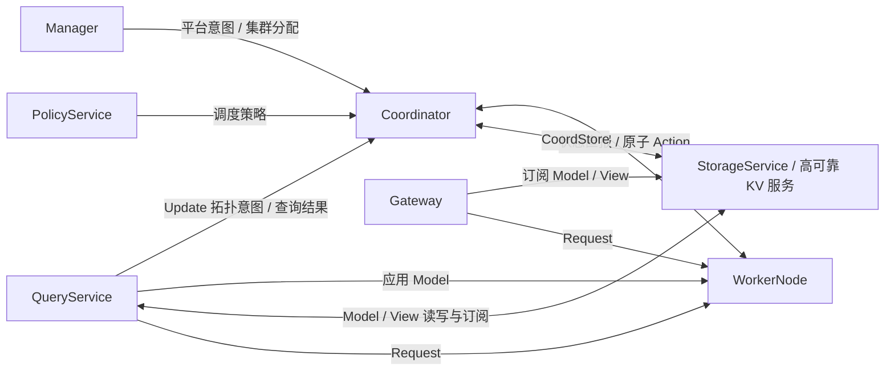
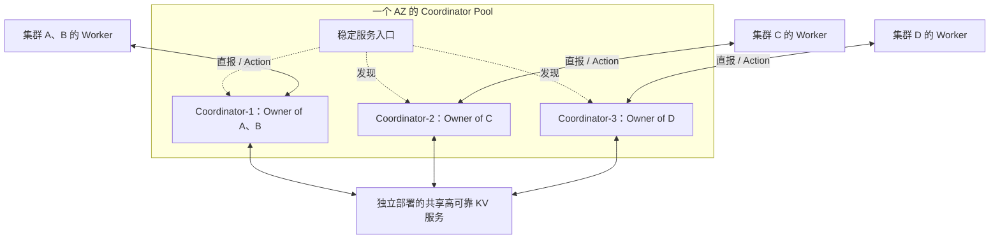
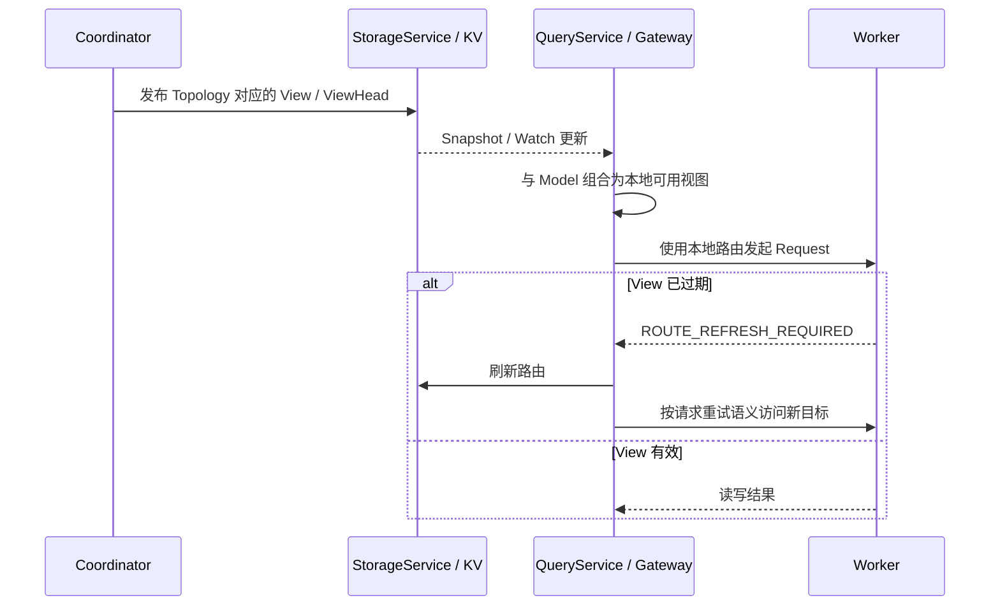

```mermaid
flowchart LR
    CM[Manager] -->|平台意图 / 集群分配| C[Coordinator]
    PM[PolicyService] -->|调度策略| C
    QE[QueryService] -->|Update 拓扑意图 / 查询结果| C
    C <-->|状态直报 / 原子 Action| Worker[WorkerNode]
    QE -->|应用 Model| Worker
    C <-->|CoordStore| MP[StorageService / 高可靠 KV 服务]
    QE <-->|Model / View 读写与订阅| MP
    P[Gateway] -->|订阅 Model / View| MP
    QE -->|Request| Worker
    P -->|Request| Worker
```

```mermaid
flowchart TB
    subgraph AZ["一个 AZ 的 Coordinator Pool"]
      E[稳定服务入口]
      C1["Coordinator-1：Owner of A、B"]
      C2["Coordinator-2：Owner of C"]
      C3["Coordinator-3：Owner of D"]
      E -.发现.-> C1
      E -.发现.-> C2
      E -.发现.-> C3
    end
    A["集群 A、B 的 Worker"] <-->|直报 / Action| C1
    B["集群 C 的 Worker"] <-->|直报 / Action| C2
    D["集群 D 的 Worker"] <-->|直报 / Action| C3
    C1 <--> S["独立部署的共享高可靠 KV 服务"]
    C2 <--> S
    C3 <--> S
```

```mermaid
sequenceDiagram
    participant C as Coordinator
    participant K as StorageService / KV
    participant Q as QueryService / Gateway
    participant D as Worker
    C->>K: 发布 Topology 对应的 View / ViewHead
    K-->>Q: Snapshot / Watch 更新
    Q->>Q: 与 Model 组合为本地可用视图
    Q->>D: 使用本地路由发起 Request
    alt View 已过期
      D-->>Q: ROUTE_REFRESH_REQUIRED
      Q->>K: 刷新路由
      Q->>D: 按请求重试语义访问新目标
    else View 有效
      D-->>Q: 读写结果
    end
```
