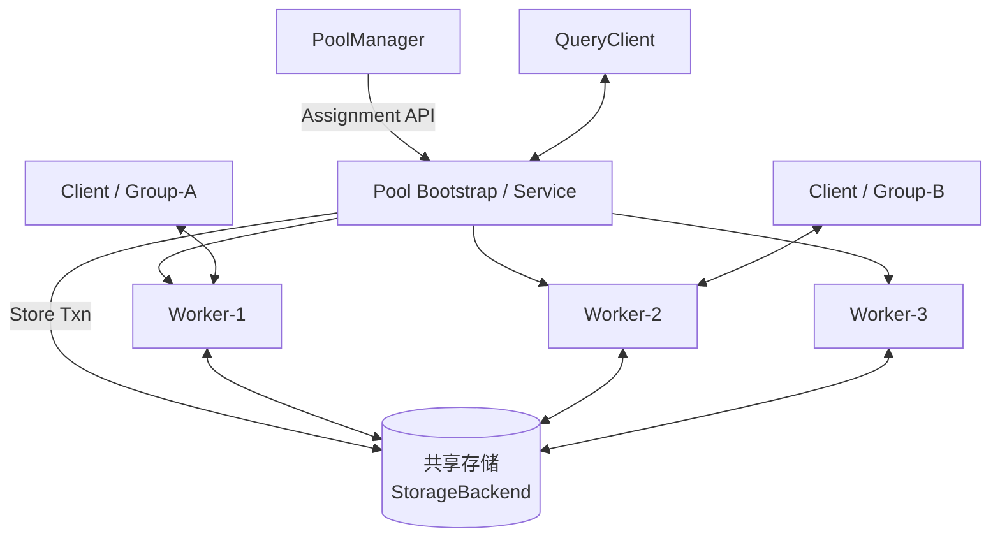
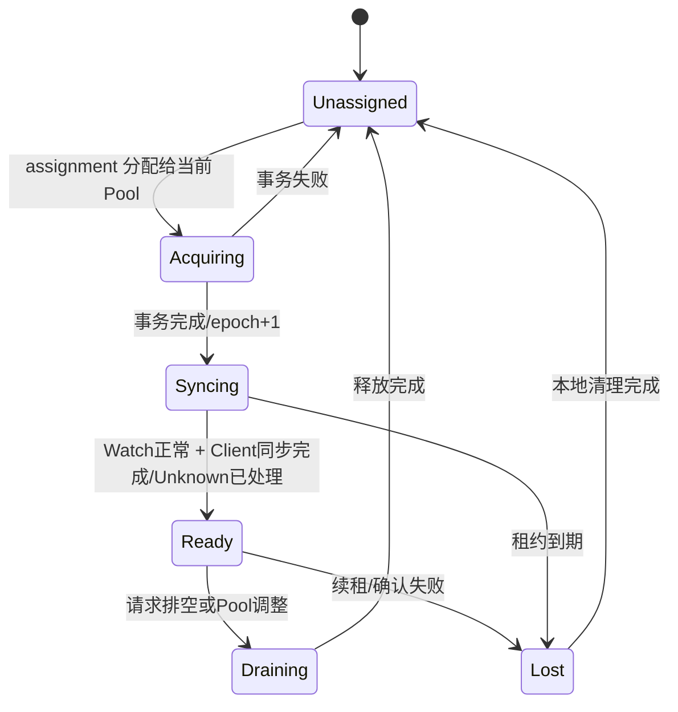

```mermaid
flowchart TB
    CM[PoolManager] -->|Assignment API| LB
    LB -->|Store Txn| KV[(共享存储<br/>StorageBackend)]
    LB[Pool Bootstrap / Service] --> C1[Worker-1]
    LB --> C2[Worker-2]
    LB --> C3[Worker-3]
    C1 <--> KV
    C2 <--> KV
    C3 <--> KV
    DN1[Client / Group-A] <--> C1
    DN2[Client / Group-B] <--> C2
    QE[QueryClient] <--> LB
```

```mermaid
stateDiagram-v2
    [*] --> Unassigned
    Unassigned --> Acquiring: assignment 分配给当前 Pool
    Acquiring --> Syncing: 事务完成/epoch+1
    Acquiring --> Unassigned: 事务失败
    Syncing --> Ready: Watch正常 + Client同步完成/Unknown已处理
    Ready --> Draining: 请求排空或Pool调整
    Ready --> Lost: 续租/确认失败
    Draining --> Unassigned: 释放完成
    Syncing --> Lost: 租约到期
    Lost --> Unassigned: 本地清理完成
```
